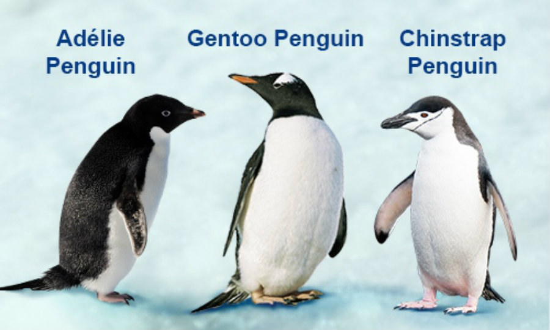

## Setup

```{r}
# Adding libraries for basic visualizations
library(ggplot2) 
library(gtsummary) 
library(tidyverse)
library(ggridges) 
library(janitor) 
library(rstatix)
library(gt)
library(exact2x2)
library(FSA)

# Adding loading/datasets for example suse
# Palmer penguins
library(palmerpenguins) # penguin measurements
penguins <- palmerpenguins::penguins
head(penguins)
```

------------------------------------------------------------------------

### Two-Sample T-Test

**When:** continuous outcome variable, two independent groups in predictor, and independence between observations.

**Assumptions:** normal distribution of outcomes in each group, and variances in each group are similar.

**Null Hypothesis:** The population difference in mean bill length (mm) between the female and male groups of penguins is 0.

$H_0: \mu_{female} - \mu_{male} = 0$

**Alternative Hypothesis:** The population difference in mean bill length (mm) between the female and male groups of penguins is statistically different from 0.

$H_A: \mu_{female} - \mu_{male} \ne 0$

```{r}
# Cleaning the dataset for sake of example
clean_penguins = na.omit(penguins)

# Assuming independence of observations
# Observing normal distribution of groups
ggplot(data = clean_penguins,
       aes(x = bill_length_mm,
           y = sex,
           fill = sex)) +
  geom_density_ridges(alpha = 0.5, # changes opacity
                      show.legend = FALSE # removes the key to the right
  )
# Using the Central Limit Theorem as n for each group is > 164
# Checking variances
sumstats <- clean_penguins %>% 
  group_by(sex) %>% 
  get_summary_stats(type = "mean_sd") 
sumstats %>% gt()

# Performing the test
t.test(bill_length_mm ~ sex, data = penguins, var.equal = TRUE)
```

Results: p-value = 1.094e-10

Using alpha = 0.05, there is sufficient evidence that the population difference in mean bill length (mm) between male and female penguins is different from 0 (p \< 0.001). The mean bill length was 42.1 mm (SD = 4.9 mm) and 45.9 mm (SD = 5.4 mm) for the female and male groups, and the difference of 3.8 mm was statistically different.

### Wilcoxon Rank-Sum (Mann-Whitney)

**When:** continuous outcome variable, two independent groups in predictor, and independence between observations.

**Assumptions:** distribution of outcomes in each group violates normality assumptions, and variances in each group are similar.

-   **Note:** If variances are not similar, the test can still be run, but it no longer showcases median difference. Significance where variance isn't similar means that there is **stochastic dominance**.

**Null Hypothesis:** The population difference in median bill length (mm) between the female and male groups of penguins is 0.

$H_0: M_{female} - M_{male} = 0$

**Alternative Hypothesis:** The population difference in median bill length (mm) between the female and male groups of penguins is statistically different from 0.

$H_A: M_{female} - M_{male} \ne 0$

```{r}
# Assuming that the distribution isn't normal enough for both groups for sake of example:

wilcox.test(bill_length_mm ~ sex, data = penguins)

# Getting median and IQR for results sentence
median(penguins$bill_depth_mm[penguins$sex == "male"], na.rm = TRUE)
IQR(penguins$bill_depth_mm[penguins$sex == "male"], na.rm = TRUE)

median(penguins$bill_depth_mm[penguins$sex == "female"], na.rm = TRUE)
IQR(penguins$bill_depth_mm[penguins$sex == "female"], na.rm = TRUE)
```

Results: p-value = 9.901e-11

Using alpha = 0.05, there is sufficient evidence that the population difference in median bill length (mm) between male and female penguins is different from 0 (p \< 0.001). The median bill length was 18.45 mm (IQR = 3.175 mm) and 17 mm (IQR = 3.3 mm) for the female and male groups, and the difference of 1.45 mm was statistically significant.

------------------------------------------------------------------------

### Paired T-Test

**When:** For when we want to compare the means of two related groups. Continuous, dependent variable, dependent paired observations.

**Assumptions:** Independence of pairs, normality of differences.

Null Hypothesis: The mean difference in extra hours of sleep after Drug 2 is 0.

$H_0: \mu_d = 0$

Alternative Hypothesis: The mean difference in extra hours of sleep after Drug 2 is statistically different from 0

$H_A: \mu_d \ne 0$

```{r}
# Adding a dataset that has data that's worth applying a paired t-test to:
# Same 10 IDs were tested with both drug types.
head(sleep)

# Observing data in a plot
boxplot(extra ~ group, data = sleep, 
        main = "Soporific Drug Effectiveness",
        xlab = "Drug Group", 
        ylab = "Extra Hours of Sleep",
        col = c("lightblue", "lightpink"))

# And performing the paired t-test
with(sleep, t.test(extra[group == 1], extra[group == 2], paired = TRUE))
# Note: "with()" is called an environment wrapper. It tells R to look inside 'sleep' for the variables that are mentioned inside of it. This option makes it so we don't have to type sleep$extra each time. 
# "extra[group == 1]" tells R "the 'extra' variable, where the condtion group == 1 is TRUE"
```

Using alpha = 0.05, there is sufficient evidence that the mean difference in extra hours of sleep after Drug 2 is different from 0 hours (p-value = 0.002833). After Drug 2, extra sleep hours increased by on average 1.58 hours (p-value 0.002833, 95% CI = 0.7001, 2.4599).

### Wilcoxon Signed-Rank

**When:** For when we want to compare the means of two related group, but paired differences aren't normally distributed, dependent variable is ordinal, and/or the sample size is too small to assume normality.

**Assumptions:** Independence of pairs, paired observations, symmetric distribution of differences.

Null Hypothesis: The median difference in extra hours of sleep after Drug 2 is 0.

$H_0: M_d = 0$

Alternative Hypothesis: The median difference in extra hours of sleep after Drug 2 is statistically different from 0

$H_A: Md \ne 0$

```{r}
# Graphing distribution of differences
sleep_diff_tidy <- sleep %>%
  mutate(group = paste0("drug_", group)) %>% # Renames 1 and 2 to drug_1 and drug_2
  pivot_wider(names_from = group, values_from = extra) %>%
  mutate(difference = drug_2 - drug_1)

ggplot(sleep_diff_tidy, aes(x = difference)) +
  geom_histogram(aes(y = after_stat(density)), bins = 5, 
                 fill = "skyblue", color = "white", alpha = 0.7) +
  geom_density(color = "darkblue", linewidth = 1) +
  geom_vline(xintercept = 0, color = "red", linetype = "dashed", linewidth = 1) +
  labs(
    title = "Distribution of Sleep Differences",
    subtitle = "Values to the right of the red line mean Drug 2 outperformed Drug 1",
    x = "Difference in Hours (Drug 2 - Drug 1)",
    y = "Density"
  ) +
  theme_minimal()

# Assuming the differences between ours pairs are NOT NORMALLLY DISTRIBUTED
with(sleep, wilcox.test(extra[group == 1], extra[group == 2], paired = TRUE, exact= FALSE, conf.int = TRUE))
# Applying exact = FALSE because patient 5 showed 0 change between drugs and patients 3 and 4 had the exact same difference between their drugs. 
```

Using alpha = 0.05, there is sufficient evidence that the median difference in extra hours of sleep after Drug 2 is different from 0 hours (p-value = 0.00901). After Drug 2, extra sleep hours increased by on average 1.400 hours (p-value 0.00901, 95% CI = 1.5002, 2.9499).

------------------------------------------------------------------------

### One-Way ANOVA

**When:** For performing a continuous outcome between 3+ groups.

**Assumptions:** Continuous dependent variable, independence of observations, normality, homogeneity of variances (homoskedasticity).

Null Hypothesis: All group means are not statistically different from each other.

$H_0: \mu_{adelie} = \mu_{gentoo} = \mu_{chinstrap}$

Alternative Hypothesis: Atleast one group of means between species of penguins is statistically different from the others.

$H_A: \mu_{adelie} \ne \mu_{gentoo} \ne \mu_{chinstrap}$

```{r}
# Checking distribution and sample size
ggplot(data = penguins,
       aes(x = bill_length_mm,
           color = species)) + # Note that we put 'color' here instead of 'y'
  geom_density() 

table(penguins$species)

# Performing an anova, given n > 60 for each group and normal-appearing distributions
peng_anova <- aov(bill_depth_mm ~ species,
                  data = penguins)
summary(peng_anova)
```

Using alpha = 0.05, we can reject the null hypothesis. At least one of the species group means is significantly different from the others (p-value \< 2e-16).

Now that we know at least one group is different, we can perform a post-hoc Tukey HSD test to determine which group(s) are different from each other.

```{r}
tuk_peng <- TukeyHSD(peng_anova)
tuk_peng
```

The differences between Gentoo and the other species are significantly different (p \< 0.0001 for both cases). Chinstrap and Adelie are not significantly different from each other (p = 0.893).

### Kruskal-Wallis

**When:** For performing a continuous outcome between 3+ groups when anova assumptions are violated.

**Assumptions:** Three or more independent, categorical groups, continuous or ordinal independent variable, independence of observations, similarity of distribution shapes.

Null Hypothesis: All group medians are not statistically different from each other.

$H_0: M_{adelie} = M_{gentoo} = M_{chinstrap}$

Alternative Hypothesis: Atleast one group of medians between species of penguins is statistically different from the others.

$H_A: M_{adelie} \ne M_{gentoo} \ne M_{chinstrap}$

```{r}
# Assuming these species' bill depths violate normal distribution
# From the graph above and sample sizes, this isn't the case, but performing this test as an example. 
kruskal.test(bill_depth_mm ~ species,
             data = penguins)
```

Using alpha = 0.05, we can reject the null hypothesis. At least one of the species group medians is significantly different from the others (p-value \< 2e-16).

Similar to the ANOVA test, we must now perform a post-hoc test to determine which group is meaningfully different from the others.

```{r}
# Performing a Dunn's Test
dunnTest(bill_depth_mm ~ species,
         data = penguins,
         method = "holm") # Similar to a bonferroni correction, but with less risk of Type II errors
```

The differences between Gentoo and the other species are significantly different (p \< 0.0001 for both cases). Chinstrap and Adelie are not significantly different from each other (p = 0.656).

------------------------------------------------------------------------

### Pearson Correlation

**When:** For measuring the strength and direction of a linear relationship between two quantitative & continuous variables.

**Assumptions:** Two continuous variables, a roughly linear relationship, normal distribution, no extreme outliers, independence of observations.

Null Hypothesis: There is no linear relationship between the two variables in the population

$H_0: p = 0$

*(p is the Pearson correlation coefficient that ranges from -1 to 1, with extrema indicating a perfect positive/negative relationship between the two variables).*

Alternative Hypothesis: There is a significant linear relationship between the two variables in the population.

$H_A: p \ne 0$

```{r}
# Visualizing the relationship
ggplot(data = penguins,
       aes( x = bill_depth_mm,
            y = body_mass_g)) +
  geom_point() +
  geom_smooth(method = "lm")

# Note that this is a ***Simpson's Paradox***. The species groups each have a seemingly positive correlation between bill depth and body mass, but together the correlation appears negative.
# For sake of proper analysis, I'll be looking at only one species of penguin here.
adelie <- penguins %>% 
  filter(species == "Adelie")
nrow(adelie) # should be 152

# Visualizing the relationship among Adelie only
ggplot(data = adelie,
       aes( x = bill_depth_mm,
            y = body_mass_g)) +
  geom_point() +
  geom_smooth(method = "lm")
# This tells quite a different story, doesn't it?
# Visualizing data is a **VERY** important aspect of analysis. 

# Testing pearson correlation
cor.test(~ bill_depth_mm + body_mass_g, 
         method = "pearson", 
         data = adelie)


```

A Pearson correlation coefficient was computed to assess the linear relationship between bill depth (mm) and body mass (g) among Adelie penguins. There was a statistically significant, moderate positive correlation between the two variables, r(149) = 0.5761, p 9.942e-15. This indicates that Adelie penguins with greater bill depth also tended to weigh more.

P.S. at this point, it helps to see the penguins we've been working with:



### Spearman Correlation

**When:** For measuring the strength of a linear relationship between two continuous variables. Unlike Pearson, however, Spearman is better for monotonic relationships, ordinal data, or skewed data distributions.

**Assumptions:** Two ordinal or continuous variables, monotonic relationship, data represents paired observations.

Null Hypothesis: There is no monotonic relationship between the two variables in the population

$H_0: p_s = 0$

*(p is the Pearson correlation coefficient that ranges from -1 to 1, with extrema indicating a perfect positive/negative relationship between the two variables).*

Alternative Hypothesis: There is a significant monotonic relationship between the two variables in the population.

$H_A: p_s \ne 0$

```{r}
data("USJudgeRatings")
#We'll be comparing demeanor vs integrity of judges in the US.

# Visualizing the relationship
ggplot(data = USJudgeRatings,
       aes( x = INTG,
            y = DMNR)) +
  geom_point() +
  geom_smooth(method = "lm")

# Testing pearson correlation
cor.test(USJudgeRatings$INTG, USJudgeRatings$DMNR, method = "spearman")

# Getting the df for results reporting.
df <- nrow(USJudgeRatings) - 2
df
```

A Spearman rank-order correlation was computed to assess the monotonic relationship between judge integrity and demeanor. There was a statistically significant, strong positive correlation between these variables r_s(41) = 0.9584, p \< 2.2e-16. This demonstrates that higher ranks in a judge's integrity are strongly associated with higher ranks in a judge's demeanor.

------------------------------------------------------------------------

### Chi-square Test of Independence

**When:** For comparing the frequencies of two categorical variables

**Assumptions:** Independent observations, mutually exclusive categories, expected cell frequencies must be at least 5 in 80% of cells, no cell can have an expected count below 1.

Null Hypothesis: The two variables are not related

$H_0: p_{ij} = p_i * p_j$ for all categories

Alternative Hypothesis: The two variables are related (dependent)

$H_0: p_{ij} \ne p_i * p_j$ for at least 1 category.

```{r}
data("HairEyeColor")
# This is a dataset that looks at the hair and eyecolor of a sample of statistics students
head(HairEyeColor)
# The data needs to be collapsed into a single table that isn't split by sex
hair_eye <- margin.table(HairEyeColor, margin = c(1,2))
head(hair_eye)

# Then we can run the chisq test to see if hair and eye color are independent.
hair_and_eye_results <- chisq.test(hair_eye)
hair_and_eye_results
```

A Chi-Square test of independence was performed to examine the relation between eye color and hair color. The relation between these variables was significant, $\chi^2$ (9, N = 592) = 138.29, p \< 2.2e-16.

*At this point with a smaller table (e.g., a 2x2, we'd have a sense of which combination is more likely than the others. Since our table is a 4x4, that pattern is less clear. In a larger contingency table like this, our results only let us know that a pattern exists. To find more information, we need additional testing.*

```{r}
resids <- hair_and_eye_results$stdres
print(resids)

# Any cell that has a |value| more extreme than 1.96 is significant at alpha 0.05.
sig_cells <- abs(resids) > 1.96
print(sig_cells)
```

... Adjusted standardized residuals were calculated to evaluate specific cell patterns using a critical threshold of \|z\| \> 1.96. Inspection of residuals revealed a complex pattern where most but not all cells deviated significantly from expected values. Below, significant cells are summarized. Assuming expected random distributions:

-   Brown eyes and black hair was observed significantly more often than inspected (Z = 6.14).

-   Blue eyes and black hair was observed significantly less often than expected ( Z = -4.15).

-   Green eyes and black hair was observed significantly less often than expected ( Z = -2.29).

-   Brown eyes and brown hair was observed significantly more often than inspected (Z = 2.16).

-   Blue eyes and brown hair was observed significantly less often than expected ( Z = -3.40).

-   Brown eyes and hazel hair was observed significantly more often than inspected (Z = 2.05).

-   Blue eyes and red hair was observed significantly less often than expected ( Z = -2.31).

-   Green eyes and red hair was observed significantly more often than inspected (Z = 2.58).

-   Brown eyes and blonde hair was observed significantly less often than expected ( Z = -8.33).

-   Blue eyes and blonde hair was observed significantly more often than expected (Z = 9.97)

-   Hazel eyes and blonde hair was observed significantly less often than expected (Z = -2.74)

Otherwise, cells did not significantly deviate from expected values.

### Fisher's Exact Test

**When:** For comparing the frequencies of two categorical variables when expected cell counts are \<5

```{r}
# We can subset the hair-eye dataset to get smaller expected counts in our cells for an example.
hair_eye_small <- HairEyeColor[c("Black", "Blond"), c("Green", "Hazel"), "Female"]
head(hair_eye_small)

# Running a chisq.test() on a table that's too small will return a warning
chisq.test(hair_eye_small)

# In this case, we can then run a Fisher's Exact Test instead!
fisher.test(hair_eye_small)
```

------------------------------------------------------------------------

### McNemar's Test

For paired data with a categorical outcome.

```{r}
# Making an example dataset for this option:
sentiment <- matrix(c(5254, 899, 348, 8881),
                    nrow = 2,
                    dimnames = list(
                      "Before Class" = c("Understanding", "Confused"),
                      "After Class" = c("Understanding", "Confused")
                    ))
sentiment

# Running the test
mcnemar.test(sentiment)
```

### Exact McNemar

For paired data with a categorical outcome, but when discordant pairs (understanding -\> confused and vice versa) add up to less than 25

```{r}
# Making an example dataset for this option:
sentiment_xs <- matrix(c(5, 8, 3, 8),
                    nrow = 2,
                    dimnames = list(
                      "Before Class" = c("Understanding", "Confused"),
                      "After Class" = c("Understanding", "Confused")
                    ))
sentiment_xs

mcnemar.exact(sentiment_xs)
```
